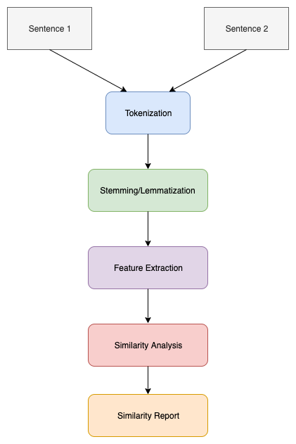

# Paraphrase-Detection
Paraphrase detection is the task of examining two text entities (ex. sentence) and determining whether they have the same meaning. In order to obtain high accuracy on this task, thorough syntactic and semantic analysis of the two text entities is required.

## What is Paraphrase?
In simple words, paraphrase is just an alternative representation of the same meaning.

## Quora Question Pairs Dataset
There are over 400,000 lines of potential question duplicate pairs. Each line contains IDs for each question in the pair, the full text for each question, and a binary value that indicates whether the line truly contains a duplicate pair.

We can download dataset from [Quora Question Pairs Dataset](https://www.kaggle.com/quora/question-pairs-dataset)
